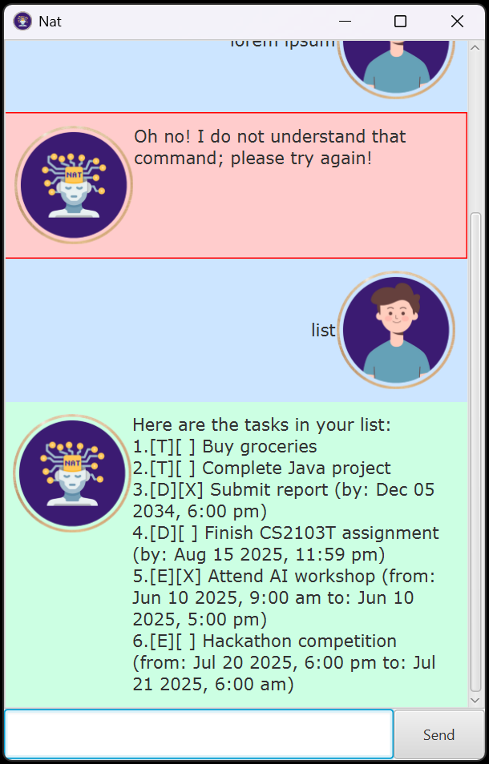

# **Nat User Guide**



Welcome to **Nat**, a task management chatbot that helps you organize your tasks efficiently through a GUI interface.

## **Table of Contents**
1. [Features](#features)
    - [Adding Tasks](#adding-tasks)
    - [Listing Tasks](#listing-tasks)
    - [Marking/Unmarking Tasks](#markingunmarking-tasks)
    - [Deleting Tasks](#deleting-tasks)
    - [Finding Tasks](#finding-tasks)
    - [Sorting Tasks](#sorting-tasks)
    - [Saving & Loading](#saving--loading)
    - [Exiting the Application](#exiting-the-application)
2. [Command Summary](#command-summary)

---

## **Features**

### **Adding Tasks**
#### **ToDo**
Adds a simple task without a deadline.
```
todo <task_name>
```
Example:
```
todo Buy groceries
```
✅ *Adds a task: "Buy groceries".*

#### **Deadline**
Adds a task with a specific deadline.
```
deadline <task_name> /by <date> <time>
```
Example:
```
deadline Submit report /by 5/12/2034 1800
```
✅ *Adds "Submit report", due on December 5, 2034, at 6:00 PM.*

#### **Event**
Adds a task with a start and end time.
```
event <task_name> /from <start_date> <start_time> /to <end_date> <end_time>
```
Example:
```
event Attend AI workshop /from 10/6/2025 0900 /to 10/6/2025 1700
```
✅ *Adds "Attend AI workshop" from 9:00 AM to 5:00 PM on June 10, 2025.*

---

### **Listing Tasks**
Displays all saved tasks.
```
list
```
Example output:
```
Here are the tasks in your list:
1. [T][ ] Buy groceries
2. [D][ ] Submit report (by: Dec 5 2034, 6:00 PM)
3. [E][ ] Attend AI workshop (from: Jun 10 2025, 9:00 AM to: Jun 10 2025, 5:00 PM)
```

---

### **Marking/Unmarking Tasks**
#### **Mark a task as done**
```
mark <task_number>
```
Example:
```
mark 1
```
✅ *Marks task 1 as completed.*

#### **Unmark a task as not done**
```
unmark <task_number>
```
Example:
```
unmark 1
```
✅ *Marks task 1 as incomplete.*

---

### **Deleting Tasks**
Removes a task from the list.
```
delete <task_number>
```
Example:
```
delete 2
```
✅ *Removes task 2.*

---

### **Finding Tasks**
Search for tasks by keyword.
```
find <keyword>
```
Example:
```
find AI
```
✅ *Finds all tasks containing "AI".*

---

### **Sorting Tasks**
Sorts tasks alphabetically.
```
sort
```
Example:
```
Tasks sorted alphabetically:
1. [T][ ] Buy groceries
2. [E][ ] Attend AI workshop (from: Jun 10 2025, 9:00 AM to: Jun 10 2025, 5:00 PM)
3. [D][ ] Submit report (by: Dec 5 2034, 6:00 PM)
```

---

### **Saving & Loading**
- Tasks are **automatically saved** when you exit.
- Tasks **load automatically** when you restart.

---

### **Exiting the Application**
To close **Nat**, use:
```
bye
```
✅ *Saves tasks and exits.*

---

## **Command Summary**
| Command | Description |
|---------|------------|
| `todo <task_name>` | Adds a ToDo task |
| `deadline <task_name> /by <date> <time>` | Adds a Deadline task |
| `event <task_name> /from <start_date> <start_time> /to <end_date> <end_time>` | Adds an Event task |
| `list` | Shows all tasks |
| `mark <task_number>` | Marks a task as done |
| `unmark <task_number>` | Marks a task as not done |
| `delete <task_number>` | Deletes a task |
| `find <keyword>` | Finds tasks with the keyword |
| `sort` | Sorts tasks alphabetically |
| `bye` | Exits the application |
